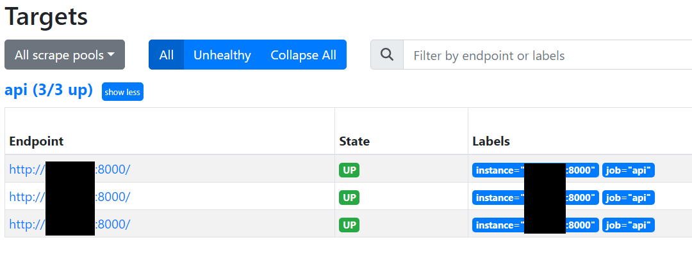
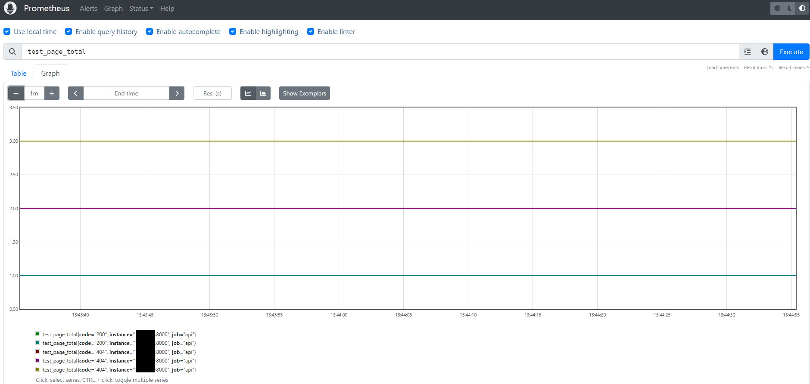

# Collecting and presenting metrics from multiple application replicas
Using Prometheus to collect metrics from multiple flask accplication replicasand present them in Grafana.

# Introduction
This is a "cheat sheet" for metrics collection and presentation.
Based on what I've learnt from book "Learn Docker in a Month of Lunches" - especially chapter 9.
See more: https://github.com/sixeyed/diamol/tree/master/ch09/exercises

## Prerequisities
* python3.10
* docker
* docker compose

## app
Flask application with two endpoints and prometheus client library for providing metrics.

## prometheus
We need only configuration file. Note we are using dns names `tasks.api`.
`api` stands for application service name (see `docker-compose.yml`).

`tasks`:

"To resolve the virtual IP addresses of all service replicas running in my Docker swarm I have to lookup the tasks.<service name> domain name (see Docker overlay network documentation)"

See more: https://www.innoq.com/en/blog/scraping-docker-swarm-service-instances-with-prometheus/

## grafana
Configuration files and sample dashboards attached in `json` and `yaml` files.

## How to run
### Create service stack
1. Build docker images listed in docker-compose.yml:
```shell
docker compose build
```
2. Run docker stack:
```shell
docker stack deploy -c .\docker-compose.yml my_api
```
### Test is out!
* Prometheus is available at http://127.0.0.1:9090
* Flask app is running at 127.0.0.1:9091, you can run a couple of times available endpoints:
  * http://127.0.0.1:9091/
  * http://127.0.0.1:9091/test
* Go to http://127.0.0.1:9090/targets?search= and check if there are 3 endpoints for metrics scrapping


* Go to prometheus graphs http://127.0.0.1:9090/graph
  * for `/test` endpoint metric name is `test_page_total`
  * for `/`endpoint metric name is `main_page_total`



* Grafana is available at http://127.0.0.1:3000/ with sample dashboards.